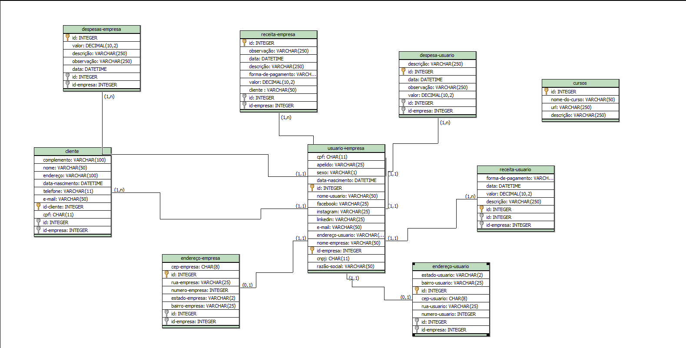

# GestãoCash

## Descrição do projeto:

O GestãoCash é uma aplicação para ajudar pequenos empreendedores no gerenciamento do seu negóico, além disso dispõe de parcerias para seu desenvolvimento.

[Clique aqui para acessar a aplicação em funcionamento](https://projeto-final-ochre.vercel.app/)

## Modelagem de dados

## Pagina principal do projeto:

## Integrantes

-   Leando Costa
-   Luiz Phelipe
-   Maicon Nunes

## Tecnologias usadas

-   HTML
-   CSS
-   BOOTSTRAP
-   JAVASCRIPT NOS GRÁFICOS
-   JAVA SPRING
-   POSTGRESS
